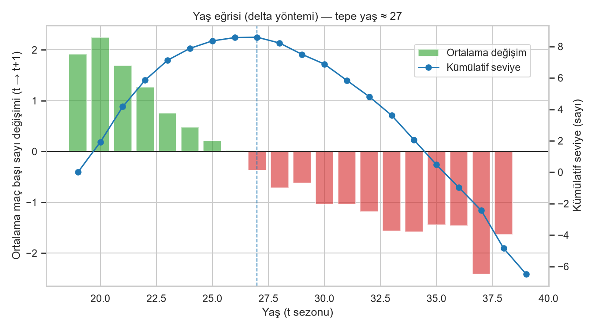
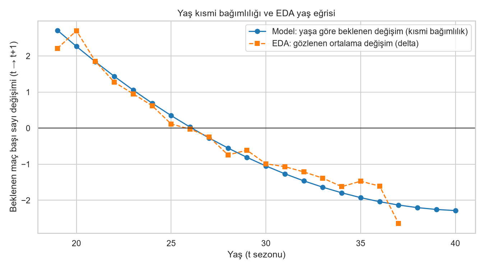

# NBA Oyuncu Sayı Tahmini (2026-27)

Bir NBA oyuncusunun bu sezon ve önceki sezonlardaki istatistiklerinden **bir sonraki sezondaki
maç başı sayı ortalamasını** tahmin eden, sızıntısız ve uçtan uca tekrar üretilebilir bir
regresyon pipeline'ı. Tüm sayılar `reports/` altındaki dosyalardan gelir.

**Kısa özet:** Doğrulamada seçilen Ridge modeli, **test** kümesinde (2023-24 ve 2024-25 →
hedefler 2024-25 ve 2025-26) MAE **2.402** ile naif baseline'ı (2.568) ve Marcel baseline'ını
(2.565) yendi. 2025-26 verisiyle 406 oyuncu için 2026-27 tahmini ve %80 tahmin aralığı üretildi.

## Problem

Gözlem birimi bir **oyuncu-sezon** satırıdır (`PLAYER_ID`, `SEZON_YIL`). Hedef `HEDEF_PTS`,
aynı oyuncunun **bir sonraki ardışık sezondaki** maç başı sayısıdır (oyuncu ertesi sezon
oynamadıysa ya da sezon atladıysa hedef yoktur). Altın kural: t+1 sezonuna ait hiçbir bilgi
öznitelik olamaz. Amaç, 2025-26 sezonu verisiyle **2026-27** sezonu için tahmin ve %80
tahmin aralığı üretmektir.

## Veri ve Filtreler

- **Kaynak:** yalnızca [`nba_api`](https://github.com/swar/nba_api) — `LeagueDashPlayerStats`,
  Normal Sezon, `PerGame`, `Base` + `Advanced` ölçümleri. Her sezon/ölçüm `data/raw/` altına
  önbelleğe alınır (52 dosya); önbellek varsa API'ye gidilmez.
- **Kapsam:** 2000-01 → 2025-26 (26 sezon), `data/processed/oyuncu_sezon.csv`: **12.810**
  oyuncu-sezon satırı (yıl başına 428-605).
- **Filtreler:** t sezonunda **GP ≥ 20** ve **MIN ≥ 10**; eğitim/doğrulama/test satırlarında
  ayrıca hedef dolu ve t+1 sezonunda **GP ≥ 20**.
- **Seçim etkisi:** Değerlendirme yalnızca ertesi sezon en az 20 maç oynayanlarla yapıldığından
  model aslında *"oyuncu anlamlı süre alırsa kaç sayı atar?"* sorusunu cevaplar. Ciddi
  sakatlık ya da ligden çıkış tahmin edilmez.

## EDA Bulguları



- **Yaş eğrisi (delta yöntemi):** ardışık iki sezonda da filtreyi geçen 7.398 çiftte ortalama
  sayı değişimi 26 yaşına kadar pozitif, sonra negatif; **tepe yaş 27**.
- **Sezondan sezona korelasyonlar:** PTS **0.865**, MIN **0.758**, 36 dakika başına sayı
  (PTS_36) **0.857**. Skor üretme hızı dakikadan daha istikrarlı; dakika (rol) daha oynak.
- **Ortalamaya dönüş:** önceki yıl değişimi ile sonraki değişim arasında eğim **−0.086**
  (büyük sıçramaları kısmi gerileme izler) → tek sezon yerine çok sezonlu ağırlıklı ortalama.
- **Hayatta kalma yanlılığı:** ertesi sezon veride olmayan oyuncu oranı ≤23 yaşta %5.0'ten 34+
  yaşta %26.0'ya çıkıyor ve çıkanların sayı ortalaması kalanlardan düşük. Delta yöntemi yalnızca
  ligde kalanları gördüğü için yaşlanma düşüşü olduğundan **hafif** görünür.

Ayrıntılar: [`reports/eda_bulgular.md`](reports/eda_bulgular.md).

## Yöntem

- **Öznitelikler (26, yalnızca t ve öncesi):** ham t istatistikleri (AGE, GP, MIN, PTS, FGA,
  FTA, AST, REB, TOV, USG_PCT, TS_PCT); hız (PTS_36, FGA_36, FTA_36, FG3A_ORAN); geçmiş
  (PTS_L1, PTS_L2, MIN_L1, PTS_36_L1, GP_L1 — **ardışık sezon kontrollü**, sezon boşluğunda NaN);
  5-4-3 ağırlıklı sayı ortalaması; trendler; AGE_KARE, GECMIS_SEZON; TAKIM_DEGISTI (t−1 → t,
  `TEAM_ID` ile; taşınmalar değişim sayılmaz).
- **Sızıntı testi:** t sezonunun öznitelikleri, t sonrası tüm veri silindiğinde aynı kalmalı
  (`tests/test_sizinti.py`); sızdıran bir sütunun bu testi kırdığı ayrıca doğrulandı.
- **Zamansal bölme (rastgele bölme yok):**

  | Küme | t sezonları | Hedef sezonları | Satır |
  |---|---|---|---|
  | Eğitim | 2000-01 … 2019-20 | … 2020-21 | 6066 |
  | Doğrulama | 2020-21 … 2022-23 | 2021-22 … 2023-24 | 1009 |
  | Test | 2023-24, 2024-25 | 2024-25, 2025-26 | 665 |
  | Tahmin | 2025-26 | 2026-27 | 406 |

  Rastgele bölme, aynı oyuncunun komşu sezonlarını eğitim ve teste dağıtır ve "geleceği
  bilerek" ölçüm yapar; gerçek kullanımda geçmişten geleceği tahmin ettiğimiz için değerlendirme
  de zamana göre yapılmalıdır.
- **Modeller:** naif (PTS_t), Marcel (5-4-3 ağırlıklı ort. + yalnız eğitimden hesaplanan yaş
  eğrisi), Ridge ve RandomForest (medyan doldurma + eksiklik göstergesi, sklearn Pipeline),
  LightGBM (NaN doğal, doğrulamada erken durdurma). Izgara araması yalnızca eğitim +
  doğrulama ile; seçim doğrulama MAE'siyle, fark < 0,02 ise daha basit model.
- **Test seti koruması:** test kümesi seçimden sonra **bir kez** kullanıldı;
  `reports/test_kullanildi.flag` farklı bir modelle test değerlendirmesini reddeder.
- **Aralık:** LightGBM quantile (α = 0,1 ve 0,9) → %80 tahmin aralığı.

## Sonuçlar

| Model | Doğrulama MAE | Test MAE | Test R² |
|---|---|---|---|
| Naif (PTS_t) | 2.381 | 2.568 | 0.755 |
| Marcel (5-4-3 + yaş) | 2.471 | 2.565 | 0.752 |
| **Ridge (α = 0,1) — seçilen** | **2.244** | **2.402** | **0.783** |
| RandomForest | 2.270 | — | — |
| LightGBM | 2.233 | — | — |

- LightGBM doğrulamada en düşük MAE'yi verdi ama Ridge'den farkı 0,011 (< 0,02) olduğundan
  daha basit ve yorumlanabilir Ridge seçildi. Test sütunları yalnızca seçilen model ve iki
  baseline için doldurulur.
- Ridge testte naiften **0.166**, Marcel'den **0.163** sayı daha düşük MAE verdi.
- Marcel doğrulamada naiften kötü çıktı: 5-4-3 ortalaması yükselen oyuncuların son sezonunu
  geride bırakıyor; bu spesifikasyonda lig ortalamasına çekme bileşeni yok.
- **Aralık kalibrasyonu:** yalnız eğitimde eğitilen quantile modelleri doğrulamada gerçek
  değerlerin **%78.7**'sini kapsadı (hedef %80; ortalama genişlik 7.1 sayı).

Ayrıntılar: [`reports/model_karsilastirma.md`](reports/model_karsilastirma.md),
[`reports/metrikler.json`](reports/metrikler.json).

## Hata Analizi



- Modelin yaş kısmi etkisi EDA eğrisiyle aynı yönde: ≤23 yaşta pozitif (19 yaşta +2.71),
  31+ yaşta negatif (31 yaşta −1.27). En etkili öznitelikler (SHAP): PTS, AGE,
  PTS_AGIRLIKLI, AGE_KARE, FGA.
- Doğrulamada ortalama tahmin 11.74, gerçek 11.25 (+0.49 hafif fazla tahmin); yanlılık en çok
  çaylaklarda ve t sezonunda az maç oynayanlarda.
- Hata en çok genç oyuncularda (≤23 yaş MAE 2.607), en az 34+ yaşta (1.417).
- Kısa sezonlar (2011-12, 2019-20, 2020-21) için 2005-2022 ileriye dönük geriye testte MAE
  normal sezonlara yakın (2.02-2.41 vs 2.22).
- **En büyük hatalar** modelin t anında göremediği rol değişikliklerinden geliyor: Lauri
  Markkanen 2022-23 (CLE → UTA, 14.8 → 25.6), Cam Thomas 2023-24 (dakika 16.6 → 31.4),
  Christian Wood 2023-24 (dakika düşüşü, 16.6 → 6.9).

Ayrıntılar: [`reports/hata_analizi.md`](reports/hata_analizi.md).

## 2026-27 Tahminleri

Model eğitim + doğrulama + test verisinin tamamıyla (7.740 satır) yeniden eğitildi. İlk 20
oyuncu (tam liste: [`reports/tahmin_2026_27.csv`](reports/tahmin_2026_27.csv); PDF sunumu:
[`reports/tahmin_2026_27.pdf`](reports/tahmin_2026_27.pdf)):

| # | Oyuncu | Takım | Yaş (25-26) | PTS 2025-26 | Tahmin 2026-27 | %80 aralık |
|---|---|---|---|---|---|---|
| 1 | Luka Dončić | LAL | 27 | 33.5 | 33.2 | 23.9 – 33.3 |
| 2 | Shai Gilgeous-Alexander | OKC | 27 | 31.1 | 31.8 | 23.8 – 32.9 |
| 3 | Anthony Edwards | MIN | 24 | 28.8 | 28.4 | 23.7 – 30.1 |
| 4 | Nikola Jokić | DEN | 31 | 27.7 | 28.3 | 23.9 – 30.4 |
| 5 | Tyrese Maxey | PHI | 25 | 28.3 | 27.9 | 23.0 – 29.2 |
| 6 | Giannis Antetokounmpo | MIL | 31 | 27.6 | 27.1 | 23.1 – 31.9 |
| 7 | Donovan Mitchell | CLE | 29 | 27.9 | 26.3 | 22.6 – 29.1 |
| 8 | Victor Wembanyama | SAS | 22 | 25.0 | 26.2 | 20.4 – 28.3 |
| 9 | Jaylen Brown | BOS | 29 | 28.7 | 25.8 | 21.8 – 28.2 |
| 10 | Jalen Brunson | NYK | 29 | 26.0 | 25.2 | 22.1 – 29.6 |
| 11 | Joel Embiid | PHI | 32 | 26.9 | 25.0 | 22.8 – 28.7 |
| 12 | Kawhi Leonard | LAC | 35 | 27.9 | 24.7 | 21.4 – 26.8 |
| 13 | Cade Cunningham | DET | 24 | 23.9 | 24.6 | 20.9 – 27.8 |
| 14 | Devin Booker | PHX | 29 | 26.1 | 24.4 | 21.5 – 29.4 |
| 15 | Jamal Murray | DEN | 29 | 25.4 | 24.1 | 20.2 – 27.0 |
| 16 | Paolo Banchero | ORL | 23 | 22.2 | 23.4 | 18.5 – 26.1 |
| 17 | Lauri Markkanen | UTA | 29 | 26.7 | 23.4 | 20.6 – 27.1 |
| 18 | Kevin Durant | HOU | 37 | 26.0 | 23.1 | 22.2 – 26.4 |
| 19 | Stephen Curry | GSW | 38 | 26.6 | 23.1 | 22.0 – 28.4 |
| 20 | Cooper Flagg | DAL | 19 | 21.0 | 23.0 | 17.2 – 25.9 |

Genç oyuncular (Wembanyama, Flagg, Banchero) için artış, 35+ yaştakiler (Leonard, Durant,
Curry) için düşüş öngörülüyor — yaş eğrisiyle tutarlı. Takım, 2025-26 sezonundaki (son) takımdır.

## Sınırlamalar

- **Seçim etkisi:** yalnızca ertesi sezon ≥ 20 maç oynayanlar değerlendirildi; sakatlık ve
  ligden çıkış tahmin edilmez.
- **Görülemeyen t+1 bilgisi:** takas, rol/dakika değişikliği, sakatlık ve takım arkadaşı
  değişimleri modelin dışında; en büyük hatalar buradan geliyor.
- **Geçmişin eksikliği:** 2000 öncesi sezonlar veride olmadığından 2000-2002 satırlarında
  `GECMIS_SEZON` ve gecikmeli öznitelikler eksik sayar.
- **Aralığın üst ucu:** ağaç tabanlı quantile modeller eğitimde görülen değerlerin ötesine
  uzanamaz; en iyi skorerlerde üst sınır nokta tahmine çok yakın (ör. Dončić 33.2 / 33.3).
- **Hayatta kalma yanlılığı:** yaş eğrisi yaşlanma düşüşünü olduğundan hafif gösterir.
- Doğrulamada hafif sistematik fazla tahmin (+0.49) var; LightGBM erken durdurması doğrulama
  kümesini kullandığından doğrulama MAE'si LightGBM lehine hafif iyimserdir.
- Python 3.11 yerine 3.12 ile geliştirildi (bkz. `KARARLAR.md` K-001).

**Gelecek çalışmalar:** iki aşamalı (dakika × hız) model, sakatlık verisi, play-by-play ve
oyuncu takip verisi.

## Nasıl Çalıştırılır

```bash
make kur && make hepsi
```

- `make kur` sanal ortamı (`.venv`) kurar ve sabitlenmiş bağımlılıkları yükler.
- `make hepsi` = `veri → eda → oznitelik → egit → test-degerlendir → yorumla → tahmin → pdf`.
  `data/raw/` önbelleği depoda olduğundan API'ye gidilmez (veri toplama hariç birkaç dakika).
- Testler: `make test` (birim, sentetik veri), `make test-veri`, `make test-tam`; lint: `make lint`.
- **GNU make yoksa (ör. Windows):** aynı `Makefile`'ı çalıştıran sarmalayıcıyı kullanın —
  Git Bash'te `./make kur && ./make hepsi`, cmd/PowerShell'de `make.bat kur` ve `make.bat hepsi`
  (`mini_make.py`, yalnızca standart kütüphane).
- Yerel uygulama: `.venv/Scripts/python.exe -m streamlit run app/streamlit_app.py`
  (Linux/macOS: `.venv/bin/python -m streamlit run app/streamlit_app.py`).

Her önemli karar ve gerekçesi [`KARARLAR.md`](KARARLAR.md) dosyasındadır.

## Sonuç Takibi

2026-27 sezonu sürüyor. **Nisan 2027'de gerçek sonuçlarla güncellenecek:** normal sezon
bittiğinde `reports/tahmin_2026_27.csv` gerçek maç başı sayılarla karşılaştırılıp MAE ve %80
aralık kapsaması bu bölüme eklenecek.
